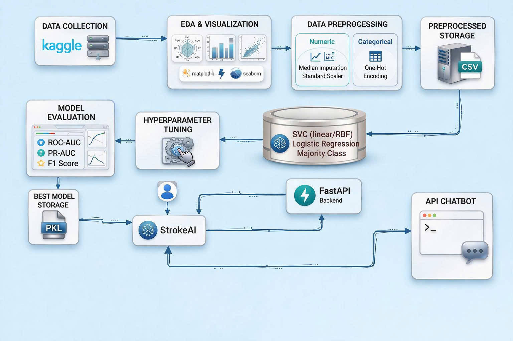

# StrokeAI – Stroke Risk Prediction & Health Support Platform


> An end-to-end machine learning web application for stroke-risk screening, healthcare data analysis, and user-oriented health support.

> ⚠️ **Medical Disclaimer:** StrokeAI is developed for academic and educational purposes only. It is not a medical device and must not be used for clinical diagnosis, emergency decisions, or treatment recommendations.

---

## Live Demo

[Open StrokeAI Web Interface](https://stroke-prediction-gamma.vercel.app/)

> **Note:** The public Vercel deployment currently provides a frontend interface preview only. Prediction and chatbot services require the FastAPI backend to run locally.

---

## Project Paper

The research paper presents the dataset analysis, preprocessing pipeline, model comparison, evaluation metrics, and key findings of this project.

[Read the StrokeAI Research Paper](docs/reports/StrokeAI_Stroke_Risk_Prediction_Study.pdf)

---

## Overview

StrokeAI is a healthcare support platform that uses machine learning to estimate stroke risk from demographic, clinical, and lifestyle-related information.

The project combines:

- Exploratory Data Analysis
- Data preprocessing and feature engineering
- Machine learning model comparison
- Stroke-risk prediction through FastAPI
- React and TypeScript web interface
- Analytics dashboard
- Basic health support chatbot

### Objectives

- Support early stroke-risk screening using machine learning.
- Identify potentially high-risk individuals from healthcare-related data.
- Provide stroke-risk probability and High/Low risk classification.
- Visualize health data and stroke-risk patterns through a dashboard.
- Improve health awareness through alerts and chatbot interaction.
- Demonstrate a complete workflow from data analysis to a web application.

---

## Core Features

### Stroke Risk Prediction

Users can enter health and demographic information such as:

- Age
- Gender
- Hypertension status
- Heart disease status
- Average glucose level
- BMI
- Work type
- Residence type
- Marital status
- Smoking status

When the local FastAPI backend is running, the system returns:

- Stroke-risk probability
- High-risk or Low-risk classification
- Basic BMI and glucose-related health alerts
- General health-awareness recommendations

### Analytics Dashboard

The dashboard allows users to explore:

- Stroke and non-stroke distribution
- Stroke patterns by age group
- Average glucose level by outcome
- Smoking-status patterns
- Health-related KPI cards
- Patient data summaries

### Health Support Chatbot

A basic chatbot provides general educational information about:

- Stroke and common risk factors
- Basic health indicators
- Platform usage
- General health awareness

> The chatbot does not provide medical diagnosis or replace professional healthcare consultation.

---

## End-to-End Workflow



```text
Dataset Collection
      ↓
EDA and Data Visualization
      ↓
Data Cleaning and Preprocessing
      ↓
Feature Engineering
      ↓
Model Training and Evaluation
      ↓
Best Model Storage (.pkl)
      ↓
FastAPI Backend
      ↓
React + TypeScript Frontend
      ↓
Risk Prediction, Dashboard, and Chatbot Support
```

---

## Dataset

**Source:** Healthcare Stroke Dataset from Kaggle

| Item | Value |
|---|---:|
| Raw samples | 5,110 |
| Samples after preprocessing | 5,109 |
| Features | 12 |
| Target variable | `stroke` |
| Stroke cases | 249 — 4.9% |
| Non-stroke cases | 4,861 — 95.1% |

Target definition:

```text
0 = No Stroke
1 = Stroke
```

The dataset is highly imbalanced because stroke cases account for only approximately 4.9% of all records. Therefore, accuracy alone is not sufficient for evaluating model performance.

### Key Features

| Category | Features |
|---|---|
| Demographic | Age, Gender, Residence Type, Ever Married |
| Clinical | Hypertension, Heart Disease, Average Glucose Level, BMI |
| Lifestyle | Work Type, Smoking Status |
| Target | Stroke |

---

## Data Preparation

The preprocessing workflow includes:

1. Loading healthcare data from a CSV file.
2. Checking data types and data quality.
3. Removing irrelevant identifiers.
4. Handling missing BMI values using median imputation.
5. Detecting possible outliers using IQR and Z-score methods.
6. Applying transformations to reduce skewness where appropriate.
7. Scaling numerical features.
8. Applying one-hot encoding to categorical variables.
9. Using stratified splitting and cross-validation to preserve class distribution.

### Key Data Insights

- Age is the strongest feature associated with stroke risk.
- Stroke cases have a substantially higher average age than non-stroke cases.
- Hypertension is associated with a higher observed stroke rate.
- Heart disease is associated with increased stroke probability.
- Average glucose level tends to be higher among stroke cases.
- BMI contains missing values and requires imputation.
- Smoking status contains a large `Unknown` category, which introduces uncertainty.

---

## Machine Learning Approach

### Models Compared

| Model | Description |
|---|---|
| Majority Class Baseline | Always predicts the most common non-stroke class |
| Logistic Regression – L2 | Interpretable linear classification model |
| Logistic Regression – L1 | Sparse logistic regression with feature selection |
| Linear SVC | Linear Support Vector Classifier |
| RBF SVC | Non-linear Support Vector Classifier |

### Training Strategy

- Stratified cross-validation
- Class-weight balancing using `class_weight="balanced"`
- Preprocessing pipeline with imputation, scaling, and encoding
- Evaluation using ROC-AUC, PR-AUC, Macro F1-score, and Recall
- Threshold analysis for screening-oriented risk detection

---

## Model Performance

| Model | ROC-AUC | PR-AUC | Macro F1-score |
|---|---:|---:|---:|
| Majority Class Baseline | 0.500 | 0.049 | - |
| Logistic Regression – L2 | 0.838 ± 0.011 | 0.191 ± 0.039 | 0.2305 ± 0.0117 |
| Logistic Regression – L1 | 0.839 ± 0.013 | 0.191 ± 0.039 | - |
| Linear SVC | 0.839 ± 0.010 | 0.196 ± 0.037 | 0.2208 ± 0.0106 |
| RBF SVC | 0.814 ± 0.018 | 0.197 ± 0.040 | 0.2018 ± 0.0152 |

### Selected Model

The local FastAPI backend uses **Logistic Regression with L2 regularization** because it provides:

- Strong predictive performance
- Probability output for risk estimation
- Better interpretability than more complex models
- Easier explanation of important risk factors
- Suitable behavior for an imbalanced healthcare dataset

---

## Threshold Analysis

Different classification thresholds were evaluated to support screening-oriented risk detection.

| Threshold | Recall | Interpretation |
|---:|---:|---|
| 0.3 | 0.84 | Detects more potentially high-risk cases |
| 0.5 | 0.80 | Default threshold used in the application |
| 0.6 | 0.78 | More conservative risk classification |

> A lower threshold can improve recall but may also increase false positives.

---

## System Architecture

```text
User
  ↓
React + TypeScript Frontend
  ↓
FastAPI Backend
  ↓
Preprocessing Pipeline
  ↓
Logistic Regression Model
  ↓
Risk Probability
  ↓
High Risk / Low Risk Classification
  ↓
Result Displayed to User
```

| Layer | Responsibility |
|---|---|
| Frontend | User input form, prediction result, dashboard, and chatbot interface |
| Backend | Receives requests and executes prediction logic |
| Preprocessing Layer | Applies imputation, scaling, and encoding |
| Model Layer | Loads the trained stroke-risk model |
| Output Layer | Returns risk probability and classification result |

---

## Repository Structure

```text
heart-stroke-prediction/
│
├── backend/
│   ├── models/
│   │   └── stroke_risk_model.pkl
│   ├── app.py
│   ├── requirements.txt
│   └── .env.local
│
├── frontend/
│   ├── components/
│   ├── pages/
│   ├── services/
│   ├── App.tsx
│   ├── index.tsx
│   ├── package.json
│   ├── vite.config.ts
│   └── .env.local
│
├── notebooks/
│   ├── EDA.ipynb
│   └── Preprocessing and train.ipynb
│
├── docs/
│   ├── images/
│   │   └── workflow.png
│   └── reports/
│       └── StrokeAI_Stroke_Risk_Prediction_Study.pdf
│
├── .gitignore
└── README.md
```

---

## Run Locally

### Prerequisites

Install:

- Python 3.10 or newer
- Node.js 18 or newer
- npm

### 1. Start the Backend

```bash
cd backend
```

Create a virtual environment:

```bash
python -m venv .venv
```

Activate it on Windows:

```bash
.venv\Scripts\activate
```

Install dependencies:

```bash
pip install -r requirements.txt
```

Run the FastAPI backend:

```bash
uvicorn app:app --reload
```

Backend URL:

```text
http://127.0.0.1:8000
```

FastAPI API documentation:

```text
http://127.0.0.1:8000/docs
```

### 2. Start the Frontend

Open a second terminal:

```bash
cd frontend
```

Install frontend dependencies:

```bash
npm install
```

Start the development server:

```bash
npm run dev
```

Open the URL shown in the terminal, usually:

```text
http://localhost:5173
```

> Ensure that the frontend API configuration points to `http://127.0.0.1:8000` when running locally.

---

## Environment Variables

The following files are intentionally excluded from GitHub:

```text
backend/.env.local
frontend/.env.local
```

These files may contain local API URLs, chatbot keys, or other sensitive configuration values.

> Never upload API keys, tokens, or private credentials to GitHub.

---

## Current Limitations

- The public Vercel deployment currently contains the frontend interface only.
- Prediction and chatbot services require the local FastAPI backend.
- The model is trained on a public Kaggle dataset rather than real hospital data.
- The dataset has severe class imbalance.
- External clinical validation has not yet been performed.
- The model is intended for risk screening, not medical diagnosis.
- Real-time hospital-data integration is not available.
- The chatbot provides basic educational support only.

---

## Future Improvements

- Deploy the FastAPI backend publicly.
- Connect the Vercel frontend to the deployed backend API.
- Add authentication and stronger security controls.
- Integrate explainable AI methods such as SHAP.
- Compare additional models such as Random Forest, XGBoost, and LightGBM.
- Experiment with SMOTE and other class-imbalance techniques.
- Add automated testing for backend and frontend.
- Validate the model using independent real-world datasets.
- Improve chatbot response quality and health-explanation features.

---

## Ethical Use

StrokeAI is intended to support health awareness and early risk screening only.

It must not:

- Replace professional medical diagnosis.
- Replace emergency medical care.
- Be used as the only basis for treatment decisions.
- Be used without healthcare professional oversight.

---

## Acknowledgments

- Kaggle Healthcare Stroke Datasetgit add README.md
- FastAPI
- Scikit-learn
- React and TypeScript
- Python machine learning ecosystem